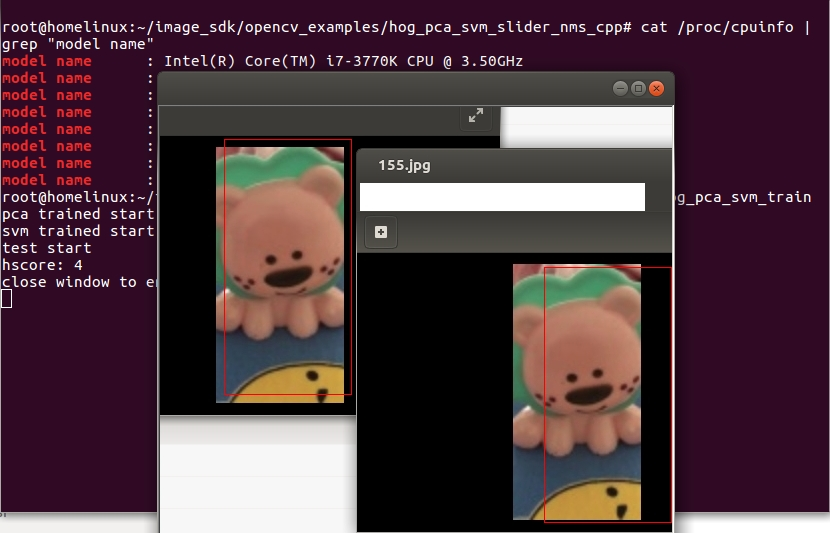

# Hog Pca Svm Slider Nms C++
nms refer to : https://github.com/Nuzhny007/Non-Maximum-Suppression  
code explain: http://fatalfeel.blogspot.com/2022/04/hog-pca-svm-slider-nms-in-c.html
# Preinstall
opencv dlib cpp  
http://fatalfeel.blogspot.com/2013/12/opencv-and-dlib-training.html
# Speed
cpu is i7-3770k of year 2012, detect 512x512 image in 21 fps
# Demo

